# Map App Integration Guide

> **Branch:** `map-merge`  
> **Date:** 2026-04-17  
> **Audience:** WordPress theme developer integrating the `<doxa-map>` web component

---

## Architecture

<p align="center">
  
</p>

---

## What Is This?

A self-contained **Vue 3 map micro-frontend** compiled to a single IIFE bundle (`map-app.iife.js`). It registers a `<doxa-map>` custom element that runs inside its own **Shadow DOM** — completely isolated from the WordPress theme's CSS and JavaScript.

You drop one PHP partial into a page template and the map appears. The bundle handles everything else: Mapbox, data fetching, legend, popups, pin filtering.

---

## Where Things Live

```
SOURCE CODE (separate GitHub repo):
  DOXA/test-wheel/           ← Vue 3 + Vite app — edit this to change the map

BUILT OUTPUT (copied here on build):
  assets/map-app/
    map-app.iife.js          ← The map application
    map-app.css              ← Scoped component styles

WORDPRESS INTEGRATION:
  partials/shadow-dom-slot.php   ← The only PHP file you need to call
  functions.php                  ← Enqueues Mapbox + the IIFE on map pages
  assets/styles/src/blocks/
    _shadow-dom-slot.scss        ← Host element sizing (aspect-ratio, min-height)
```

> **Workflow:** Edit source → `npm run build` in `test-wheel` → bundle auto-copies to `assets/map-app/` and to your local WP site.

---

## Architecture in 30 Seconds

```
WordPress page template
  └── get_template_part('partials/shadow-dom-slot', ...)
        └── <doxa-map profile-config='{...}'>   ← custom element
              └── Shadow DOM boundary
                    └── Vue app (Pinia store, Mapbox canvas, Legend UI)
```

**Why Shadow DOM?**  
The map ships its own CSS. Without Shadow DOM, Mapbox class names (`.mapboxgl-*`) and theme class names collide. Shadow DOM gives the map a completely isolated rendering context — no leakage in or out.

**Why one Pinia store per instance?**  
Each `<doxa-map>` tag on the page gets its own isolated Pinia instance. This means two maps on the same page (e.g. a prayer map and an adoption map) never share legend state, filter state, or selected pin.

---

## How to Embed a Map (the one call you need)

```php
<?php get_template_part( 'partials/shadow-dom-slot', null, [

    // ── Required ──────────────────────────────────────────────
    'profile'      => 'doxa-simple-map',
    'tk'           => defined('MAPBOX_PUBLIC_TOKEN') ? MAPBOX_PUBLIC_TOKEN : '',

    // ── Recommended ───────────────────────────────────────────
    'instance_id'  => 'pray-map',       // unique per page — scopes Pinia store
    'data_source'  => 'pray-tools',     // 'pray-tools' | 'doxa-api' | 'doxa-csv'

    // ── Tab config (controls legend + pin color + popup) ──────
    'tabs'         => [ [
        'id'            => 'prayer',    // matches internal color strategy
        'label'         => 'Prayer',
        'colorStrategy' => 'prayer',    // 'prayer' | 'engagement' | 'adoption'
        'legend'        => 'prayer',    // which legend component renders
        'popup'         => 'prayer',    // which popup content renders
    ] ],

    // ── Sizing (optional) ─────────────────────────────────────
    'radius'       => 'md',             // 'none' | 'md' | 'xlg'
    'aspect_ratio' => '16/7',

] ); ?>
```

---

## The `tabs` Prop — The Key to Everything

**`tabs` is the entire contract between WordPress and the map.** It controls three things atomically:

| `tabs` field      | Controls                          |
|-------------------|-----------------------------------|
| `colorStrategy`   | Pin colors on the Mapbox layer    |
| `legend`          | Which legend items render         |
| `popup`           | What shows when you click a pin   |

**Rule:** 1 tab = no tab bar shown. 2+ tabs = tab bar shown at top of map.

### Page → Tab Mapping (current)

```
front-page.php  →  instance: home-map   →  tabs: [engagement]
page-pray.php   →  instance: pray-map   →  tabs: [prayer]
page-adopt.php  →  instance: adopt-map  →  tabs: [adoption]
```

### Visual: one `profile-config` attribute drives the whole map

```
profile-config='{
  "profile":    "doxa-simple-map",   ← which Vue component to mount
  "instanceId": "pray-map",          ← Pinia store scope key
  "dataSource": "pray-tools",        ← which API/CSV to load
  "tk":         "pk.eyJ...",         ← Mapbox token (from wp-config.php)
  "tabs": [{
    "id":             "prayer",
    "colorStrategy":  "prayer",      ← blue dots = has prayer
    "legend":         "prayer",      ← legend shows prayer counts
    "popup":          "prayer"       ← popup shows prayer action button
  }]
}'
```

---

## Mapbox Token — Where It Lives

The token **must not be in the theme repo**. It lives in `wp-config.php` only:

```php
// wp-config.php  (server only — never committed to git)
define( 'MAPBOX_PUBLIC_TOKEN', 'pk.eyJ...' );
```

The theme reads it safely:

```php
// Any page template
'tk' => defined('MAPBOX_PUBLIC_TOKEN') ? MAPBOX_PUBLIC_TOKEN : '',
```

```php
// functions.php — also used for the legacy prayer-map script
'mapboxToken' => defined('MAPBOX_PUBLIC_TOKEN') ? MAPBOX_PUBLIC_TOKEN : '',
```

> Mapbox public tokens (`pk.eyJ...`) are safe to expose in HTML — they are rate-limited and domain-restricted per your Mapbox account settings. But keeping them in `wp-config.php` keeps the repo clean and lets different environments (local, staging, production) use different tokens.

---

## What Changed on `map-merge` Branch

| File | What Changed |
|---|---|
| `assets/styles/src/blocks/_shadow-dom-slot.scss` | **New file** — sizes the `<doxa-map>` host element (aspect-ratio, min-height, mobile overrides) |
| `assets/styles/src/blocks/_index.scss` | Added `@use 'shadow-dom-slot'` |
| `partials/shadow-dom-slot.php` | **New file** — PHP partial that renders the `<doxa-map>` element with JSON config |
| `assets/map-app/` | **New folder** — compiled IIFE bundle lives here (gitignored build output) |
| `functions.php` | Added `doxa_map_app_scripts()` — enqueues Mapbox v3, geocoder plugin, IIFE + CSS on map pages only |
| `front-page.php` | Added map section between hero and stats (engagement view) |
| `page-pray.php` | Added map section below hero (prayer view) |
| `page-adopt.php` | Added map section below hero (adoption view) |

---

## Slot Sizing

The host element is sized by CSS, not the map app. Override per-instance via the partial args:

```php
// Default: 16:9 aspect ratio, minimum 640px tall
// Nothing needed — _shadow-dom-slot.scss handles it

// Override height directly (skips aspect-ratio):
'height_desktop' => '560px',
'height_mobile'  => '480px',

// Override aspect ratio:
'aspect_ratio'   => '16/9',   // desktop
// mobile always 1/2 (portrait) — hardcoded in SCSS
```

---

## Adding a New Map Page

1. Create your PHP template (e.g. `page-give.php`)
2. Call `get_template_part( 'partials/shadow-dom-slot', ... )` with a unique `instance_id`
3. Add the page slug to `doxa_map_app_scripts()` in `functions.php`:
   ```php
   $is_map_page = is_front_page() || is_page('pray') || is_page('adopt') || is_page('give');
   ```
4. No JS or CSS changes needed — the IIFE handles it all.
